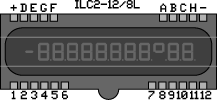
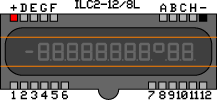
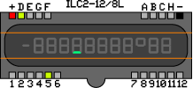
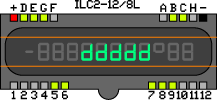
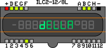

# vfd-control
Control Vacuum Fluorescent Displays with a MAX6921 Chip

For use with CircuitPython. Not an official CircuitPython library or an official Maxim library.

# What are Vacuum Fluoresent Displays?
Vacuum Fluorescent Displays are somewhere between nixie tubes, LED displays, and LCDs. During the cold war, they were used as the displays in calculators, alarm clocks, car dashboards, home stereos, and VCRs. In modern times, you can still find them being used in microwaves and cash registers. They generally glow with a blueish-green light, altho other colors are also available. You can search "vfd tube" on ebay and find a lot of cool models out there.

This library is intended for controlling the calculator and clock style of VFDs that are basically just a series of 7-segment displays in a row.

# How do they work?
I'll be using the ILC2-12/8L for all the examples here. It's the display from the Elektronika MK-52, a scientific calculator notable for being flown by the Soviet Union on some Soyuz missions and on MIR to be used as a backup if there was a problem with the rendezvous computer:

There's 2 types of pins on a VFD tube: the filament and the grid. In my diagram, i've marked the filament pins as + and -, altho they're not actually polarized at all. We want to apply low voltage across the filament pins, just enough that the filament wires barely glow, usually something in the 2 or 3 volt range:

All the other pins are for the grid. Pins 1-12 at the bottom of my screen are for the digits and pins A-H along the top row are for the segments. I'm using H to represent the decimal point instead of the more common DP, because reasons. To get a segment to light up, apply positive higher voltage (somewhere between 9 and 60 volts, depending on your display, altho 12v has worked pretty well for me on every display i've tried so far) across a segment pin and a digit pin:

To get a whole character out of this, light up multiple segments of a single digit:

Of course, if you power up multiple digits at the same time, you get copies of the same character on all those digits:

So what we need to do is light up each character we want to display one-at-a-time, in quick succession. Luckily, each segment takes a little bit of time to stop glowing once it's lost power, so we get pretty good persistence with this method:

# Wiring
I'll add some diagrams for this at some point. Check out the MAX6921 datasheet for details in the meantime.

Pro tips: 
 * Data In on the chip is MISO and Data Out is MOSI. This means you go from MOSI on your board to DIN on the chip.
 * Load on the chip is just your SPI chip select and can be any available digital out on your board.
 * The "Blank" pin on the chip can be used to blank out the whole screen. I haven't made use of it in this library because you can just print an empty string to the board to get the same effect. If you want to use it in your project, just connect to any digital out and set the value to True when you want the screen to blank.

# How do i use this library?
I plan on adding detailed instructions in the future. See code.py for some example code in the meantime.

# Troubleshooting
 * Nothing displays on the screen.
 
Start back at the beginning. Check all your wires, make sure you're initializing your VFD object with the right pins, and make sure you're calling the draw function in your main loop.
 
 * Only one character displays on the screen.
 
Make sure the draw function is being called in a loop, not just one time.
 
 * Some characters display in the wrong order.
 
The digit pins are probably listed in the wrong order when instantiating the VFD object.
 
 * Characters are just jumbled nonsense.
 
The segment pins are probably listed in the wrong order when instantiating the VFD object.
 
 * Every character lights up in order as an 8, and then goes away.
 
Double check the pins from the control board to the MAX6921. The clock and data pins might be backwards.

 * I'm using more than one MAX6921 chip in my setup, but can't get them to work together.

I >think< this library should work when using multiple MAX6921 chips in tandem, but i haven't actually tested that in reality yet.
